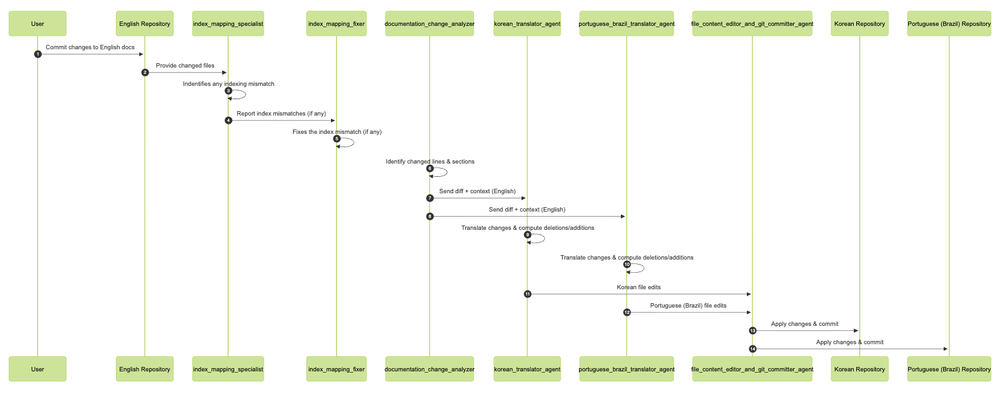
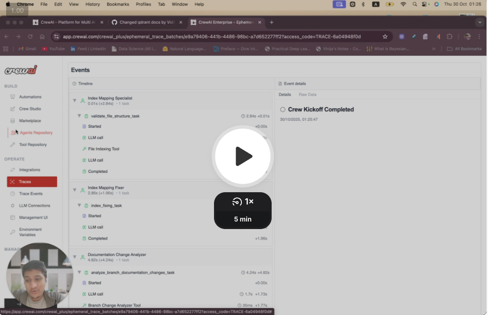
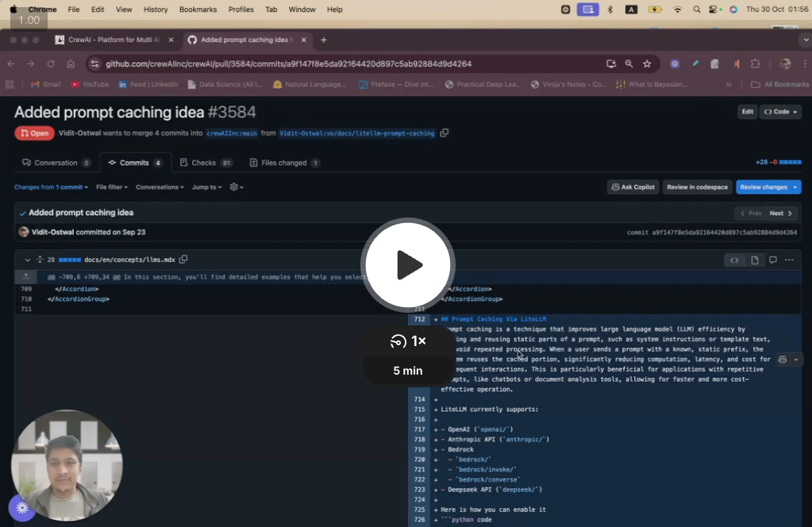
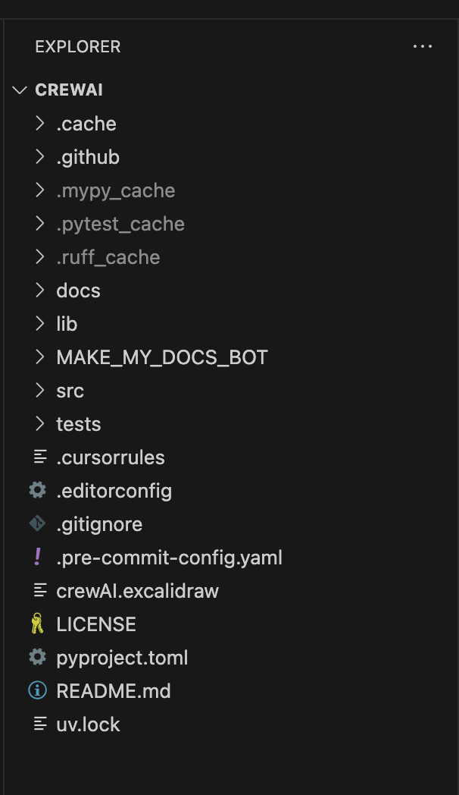

## 🏆 Announcement

**MakeMyDocsBot** was awarded **3rd Runner-Up** at the **CrewAI Fall Agentic AI Challenge** 🎉  

👉 **LinkedIn Post:** [Post](https://www.linkedin.com/posts/viditostwal_please-join-us-in-congratulating-vidit-ostwal-activity-7407046132935290881-fXyF?utm_source=share&utm_medium=member_desktop&rcm=ACoAAC7XK-wBpMJVEdMqSRQ86hXsZbgA2jZA3aw)


If you’re interested in the *why* and *how* behind MakeMyDocsBot, I’ve written a detailed Substack blog that walks through:
- The core problem with multilingual documentation
- Agent design and responsibilities
- Indexing logic and edge cases discovered during development
- How the final system came together

👉 **Substack Blog:** [Building MakeMyDocsBot](https://viditostwal.substack.com/p/building-makemydocsbot)

👉 **Notebook LM Summary:**

<video src="video/Building_MakeMyDocsBot.mp4" controls width="100%"></video>

*A quick Notebook LM–generated walkthrough explaining the full MakeMyDocsBot architecture and flow.*

---


# MakeMyDocsBot

```
 ███╗   ███╗ █████╗ ██╗  ██╗███████╗    ███╗   ███╗██╗   ██╗
 ████╗ ████║██╔══██╗██║ ██╔╝██╔════╝    ████╗ ████║╚██╗ ██╔╝
 ██╔████╔██║███████║█████╔╝ █████╗      ██╔████╔██║ ╚████╔╝ 
 ██║╚██╔╝██║██╔══██║██╔═██╗ ██╔══╝      ██║╚██╔╝██║  ╚██╔╝  
 ██║ ╚═╝ ██║██║  ██║██║  ██╗███████╗    ██║ ╚═╝ ██║   ██║   
 ╚═╝     ╚═╝╚═╝  ╚═╝╚═╝  ╚═╝╚══════╝    ╚═╝     ╚═╝   ╚═╝   
                                                              
 ██████╗  ██████╗  ██████╗███████╗    ██████╗  ██████╗ ████████╗
 ██╔══██╗██╔═══██╗██╔════╝██╔════╝    ██╔══██╗██╔═══██╗╚══██╔══╝
 ██║  ██║██║   ██║██║     ███████╗    ██████╔╝██║   ██║   ██║   
 ██║  ██║██║   ██║██║     ╚════██║    ██╔══██╗██║   ██║   ██║   
 ██████╔╝╚██████╔╝╚██████╗███████║    ██████╔╝╚██████╔╝   ██║   
 ╚═════╝  ╚═════╝  ╚═════╝╚══════╝    ╚═════╝  ╚═════╝    ╚═╝   
```

## What is MakeMyDocsBot?

**MakeMyDocsBot** is a smart documentation synchronization bot designed to help maintainers keep multi-language documentation up-to-date across feature branches.  
Built using **crewAI**, for crewai (currently) it automates the process of detecting documentation changes in English and synchronizing them into other supported languages — currently **Korean** and **Portuguese (Brazil)**.

The bot fits seamlessly into your workflow, ensuring that new features stay consistently documented across all supported locales — reducing manual overhead and improving release quality.

### 🎥 Overview Video  
See how MakeMyDocsBot works, how it fits into the ecosystem, and the agents & tasks that power it.

[](https://www.loom.com/share/a695e79df202473ab5acd3c6f6f8c585)

*MakeMyDocsBot — Overview & Architecture*
  


---
---

## DEMO

### DEMO #1 — PR->https://github.com/crewAIInc/crewAI/pull/3729

[](https://www.loom.com/share/61dd4f5fce544beaa565df6c0bd58517)

---

### DEMO #2 — PR->https://github.com/crewAIInc/crewAI/pull/3584

[](https://drive.google.com/file/d/17HElOx9ej-bdLOSlKrxBwimE65QiTxAw/view?usp=sharing)

---
---


## Installation

### Create and Activate a Virtual Environment

Use your installed Python version (e.g., Python 3.12):

```bash
python3.12 -m venv .venv
source .venv/bin/activate
```

### Install [UV](https://docs.astral.sh/uv/)

Install `uv` inside your virtual environment:

```bash
pip install uv
```

### Cloning the repository 

Fork this repository and clone it locally
```bash
git clone <clone-repo-name>
```

### Sync Dependencies

In your project root:

```bash
uv sync
```

This command:
- Reads dependencies from your `pyproject.toml` (and optionally `uv.lock`)
- Installs the exact versions specified
- Ensures consistency between environments

### Add the .env file in the cloned repository
Add the .env file with `OPENAI_API_KEY` and `OPENAI_MODEL_NAME`

```bash
OPENAI_API_KEY
OPENAI_MODEL_NAME
```

---

## Running the Project

We need to add the github hook pre-push script with which, whenever you try to push any feature branch, the pre-push script asks you to run the MAKE_MY_DOCS_BOT or not.

Make sure you are inside the crewAI repository and then run the following commands

```bash
cd .git/hooks
touch pre-push
```

Copy the entire content in the [pre-push-script](https://github.com/Vidit-Ostwal/MAKE_MY_DOCS_BOT/blob/main/pre-push-script) and paste that as it is in pre-push script.

Move the entire MAKE_MY_DOCS_BOT inside the CrewAI repository.
This is how it should look after moving it to CrewAI repository.



---

