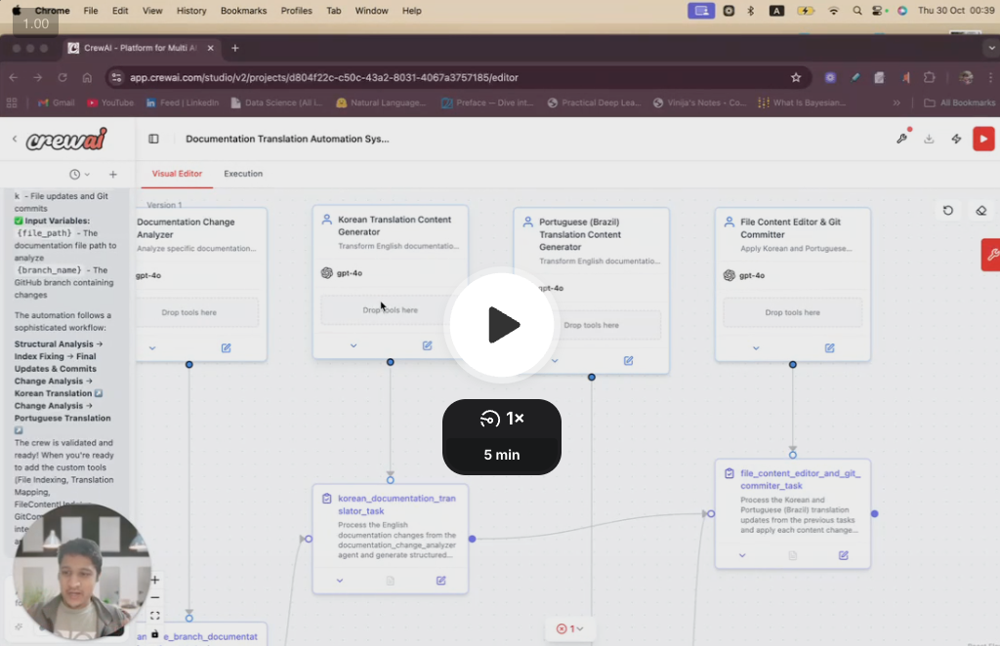

# MakeMyDocsBot

## What is MakeMyDocsBot?

**MakeMyDocsBot** is a smart documentation synchronization bot designed to help maintainers keep multi-language documentation up-to-date across feature branches.  
Built using **crewAI**, for crewai (currently) it automates the process of detecting documentation changes in English and synchronizing them into other supported languages — currently **Korean** and **Portuguese (Brazil)**.

The bot fits seamlessly into your workflow, ensuring that new features stay consistently documented across all supported locales — reducing manual overhead and improving release quality.

### 🎥 Overview Video  
See how MakeMyDocsBot works, how it fits into the ecosystem, and the agents & tasks that power it.

[](https://www.loom.com/share/a695e79df202473ab5acd3c6f6f8c585)
  


*MakeMyDocsBot — Overview & Architecture*

---

## DEMO #1 — English → Korean Synchronization

This demo showcases MakeMyDocsBot automatically translating and synchronizing English documentation updates into **Korean**.  
It detects new feature branch changes, processes updates, and creates PRs with localized content — all autonomously.

[](https://www.loom.com/share/demo1)  
*Demo #1: English → Korean Documentation Sync*

---

## DEMO #2 — English → Portuguese (Brazil) Synchronization

This demo highlights the synchronization flow for **Portuguese (Brazil)** documentation.  
The bot detects new commits in feature branches, processes English doc updates, and pushes the translated changes automatically.

[](https://www.loom.com/share/demo2)  
*Demo #2: English → Portuguese (Brazil) Documentation Sync*

---

## Installation

Before you begin, ensure you have **Python >=3.10 <3.14** installed.

### 1. Install [UV](https://docs.astral.sh/uv/)
```bash
pip install uv
```

### 2. Sync Dependencies
In your project root:
```bash
uv sync
```
Alternatively:
```bash
crewai install
```

> Dependencies are defined in `pyproject.toml` and locked via `uv.lock` for reproducibility.

### 3. Add Environment Variables
Create a `.env` file in your project root:
```bash
OPENAI_API_KEY=your_api_key_here
OPENAI_MODEL_NAME=gpt-4o-mini
```

---

## Running the Project

To launch MakeMyDocsBot and start synchronizing multilingual documentation:

```bash
crewai run
```

This command initializes the MakeMyDocsBot crew, activates its agents, and begins the documentation synchronization process as defined in your configuration files.

---

✨ *Empowering maintainers to focus on innovation — while MakeMyDocsBot keeps your documentation perfectly in sync.*
